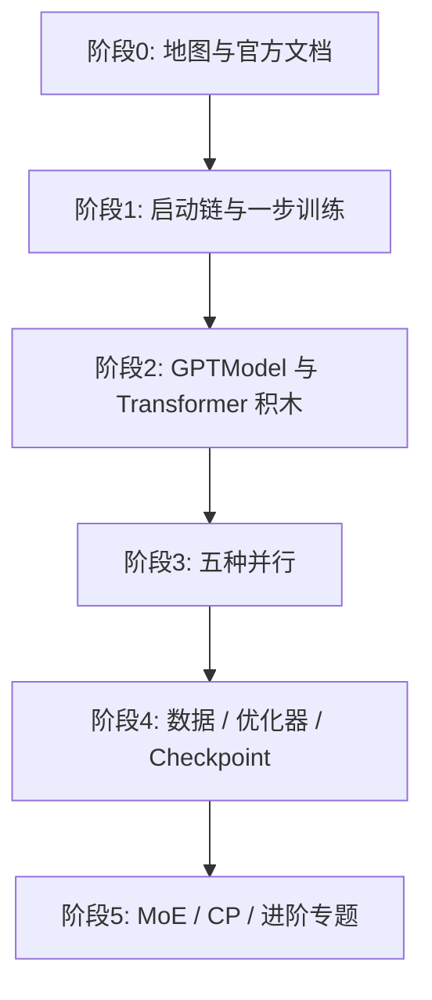

# Megatron-LM / Megatron Core 代码阅读计划

> 面向：有 PyTorch 与分布式训练基础、想系统读通 NVIDIA Megatron 源码的工程师。  
> 仓库版本参考：本仓库 `main` 分支（Megatron Core ~0.15+）。  
> 配套产出：同目录下知乎风格源码导读文章（`01`–`10` 主线 + `11` EP 专题；成稿在 `publish/`）。

---

## 一、阅读目标

读完本计划后，你应能独立完成：

1. 从 `pretrain_gpt.py` 沿调用链走到一次 `train_step`，说清「参数 → 初始化 → 模型 → 数据 → 前后向 → 优化器 → checkpoint」每一步落在哪些文件。
2. 解释 TP / PP / DP / CP / EP 各自切什么、进程组如何创建、层与调度如何消费这些组。
3. 对照 `GPTModel` + `TransformerLayer` + `ModuleSpec`，说明如何换 Attention/MLP/MoE 实现而不改训练循环。
4. 在调试 OOM、气泡、通信超时、MoE 负载不均时，知道该先打开哪几个源文件。

**非目标**：背诵全部 API；一次性读完 `legacy/`、全部测试与容器脚本。

---

## 二、仓库地图（先建立坐标系）

```
Megatron-LM/
├── pretrain_gpt.py              # GPT 预训练/SFT 入口
├── gpt_builders.py              # args → TransformerConfig + GPTModel
├── model_provider.py            # 模型构建薄封装
├── megatron/
│   ├── core/                    # ★ Megatron Core：可组合库
│   │   ├── parallel_state.py    # 进程组与 rank 拓扑
│   │   ├── process_groups_config.py
│   │   ├── tensor_parallel/     # TP 层与通信原语
│   │   ├── pipeline_parallel/   # PP 调度与 P2P
│   │   ├── distributed/         # DDP / FSDP / finalize grads
│   │   ├── transformer/         # 层、Attention、MLP、MoE、Config
│   │   ├── models/gpt/          # GPTModel
│   │   ├── datasets/            # IndexedDataset / GPTDataset
│   │   ├── optimizer/           # DistOpt / 混合精度
│   │   ├── dist_checkpointing/  # 分布式 checkpoint
│   │   └── inference/           # 推理引擎（进阶）
│   ├── training/                # 训练编排（pretrain/train_step）
│   ├── rl/                      # RL / RLHF（进阶）
│   └── post_training/           # 量化蒸馏等（进阶）
├── examples/                    # 可跑示例
└── docs/                        # 官方文档
```

两层心智模型：

| 层级 | 角色 | 典型读者入口 |
|------|------|--------------|
| **Megatron-LM** | 参考训练栈：脚本、args、数据、日志、ckpt 编排 | `pretrain_gpt.py` |
| **Megatron Core** | 可组合库：并行、层、优化器、ckpt | `megatron/core/` |

---

## 三、总阅读顺序（推荐 6 个阶段）



### 阶段 0：建立背景（0.5–1 天）

| 顺序 | 材料 | 目的 |
|------|------|------|
| 1 | 根目录 `README.md`、`megatron/core/README.md` | 分清 LM vs Core |
| 2 | `docs/get-started/overview.md`、`quickstart.md` | 官方心智模型 |
| 3 | `docs/user-guide/parallelism-guide.md` | TP/PP/DP/EP/CP 概念 |
| 4 | 跑通 `examples/run_simple_mcore_train_loop.py`（有 GPU 时） | 建立「能跑」的锚点 |

**检查点**：能用自己的话解释「Core 是库、LM 是参考训练框架」。

### 阶段 1：启动链与一步训练（2–3 天）→ 文章 01、02

| Day | 文件 | 必读符号 |
|-----|------|----------|
| D1 | `pretrain_gpt.py` | `__main__`、`forward_step`、`get_batch`、`train_valid_test_datasets_provider` |
| D1 | `model_provider.py`、`gpt_builders.py` | `model_provider`、`gpt_builder` |
| D2 | `megatron/training/arguments.py` | `parse_and_validate_args` |
| D2 | `megatron/training/initialize.py` | `initialize_megatron`、`_initialize_distributed` |
| D3 | `megatron/training/training.py` | `pretrain`、`setup_model_and_optimizer`、`train`、`train_step` |

**画图作业**：从 `parse_and_validate_args` 到 `train_step` 画一张调用序列图（含 `forward_backward_func`）。

**检查点**：能指出 `forward_step` 返回 `(output, loss_func)` 后，谁在何时调用 `loss_func`。

### 阶段 2：模型积木（2–3 天）→ 文章 03

| Day | 文件 | 必读符号 |
|-----|------|----------|
| D1 | `transformer/transformer_config.py` | `TransformerConfig` 关键字段 |
| D1 | `models/gpt/gpt_model.py` | `__init__`、`forward`、`_preprocess`、`_postprocess` |
| D2 | `transformer/transformer_block.py`、`transformer_layer.py` | `TransformerBlock`、`TransformerLayer` |
| D2 | `transformer/attention.py`、`mlp.py` | `SelfAttention`、`MLP` |
| D3 | `models/gpt/gpt_layer_specs.py`、`transformer/spec_utils.py` | `ModuleSpec`、`build_module`、各类 `get_gpt_layer_*_spec` |

**检查点**：说明把 `transformer_impl` 从 TE 换成 local 时，改动落在 Spec 还是 `GPTModel`。

### 阶段 3：并行体系（4–6 天）→ 文章 04–07

按「先拓扑、再算子、再调度、再梯度」读：

| Day | 主题 | 文件 | 必读符号 |
|-----|------|------|----------|
| D1 | 进程组 | `parallel_state.py`、`process_groups_config.py` | `RankGenerator`、`initialize_model_parallel`、`ProcessGroupCollection` |
| D2–3 | TP | `tensor_parallel/mappings.py`、`layers.py` | `ColumnParallelLinear`、`RowParallelLinear`、gather/scatter/reduce |
| D4–5 | PP | `pipeline_parallel/schedules.py`、`p2p_communication.py` | `get_forward_backward_func`、1F1B、interleaving、`P2PCommunicator` |
| D6 | DP | `distributed/distributed_data_parallel.py`、`finalize_model_grads.py`、`param_and_grad_buffer.py` | DDP bucket、`finalize_model_grads` |

**约束提醒（本仓库贡献规范）**：在 `megatron/core` 新代码中，优先注入 `ProcessGroupCollection`，避免新增直接 `parallel_state.get_*_group()` 调用。

**检查点**：给定 `TP=2, PP=2, CP=2, world=16`，算出 DP size，并说出默认 `order="tp-cp-ep-dp-pp"` 下某一 rank 的各组同伴。

### 阶段 4：数据、优化器、Checkpoint（2–3 天）→ 文章 08

| 主题 | 文件 | 必读符号 |
|------|------|----------|
| 数据 | `datasets/indexed_dataset.py`、`gpt_dataset.py`、`blended_megatron_dataset_builder.py` | `IndexedDataset`、`GPTDataset.__getitem__`、`BlendedMegatronDatasetBuilder.build` |
| 优化器 | `optimizer/__init__.py`、`optimizer.py`、`distrib_optimizer.py` | `get_megatron_optimizer`、`DistributedOptimizer`、`MixedPrecisionOptimizer` |
| Checkpoint | `dist_checkpointing/serialization.py`、`mapping.py`；编排见 `training/checkpointing.py` | `ShardedTensor`、`save`/`load` |

**检查点**：解释 DistOpt 与 FSDP 分别分片什么；dist checkpoint 如何做到「换并行度加载」。

### 阶段 5：MoE / CP / 进阶（按需 3–7 天）→ 文章 11、09、10

| 优先级 | 主题 | 入口 |
|--------|------|------|
| P0 | **先读 EP 概念**（文章 11） | `parallel_state` expert generator、`BaseMoELayer.local_expert_indices`、AlltoAll 直觉 |
| P0 | MoE 算法与实现（文章 09） | `transformer/moe/moe_layer.py`、`router.py`、`token_dispatcher.py`、`docs/user-guide/features/moe.md` |
| P0 | Context Parallel | `docs/user-guide/features/context_parallel.md` + attention 中 CP 路径 |
| P1 | FSDP | `distributed/fsdp/`、`docs/user-guide/features/megatron_fsdp.md` |
| P1 | 推理 | `megatron/core/inference/README.md` |
| P2 | RL / 多模态 / Mamba | `megatron/rl/`、`examples/multimodal/`、`models/mamba/` |

**检查点（EP）**：能区分 EP / dense DP / expert_DP；给定 `num_experts` 与 EP 写出每卡 `local_expert_indices`；说出 dispatch/combine 各通信什么。

---

## 四、分文件「必读清单」（速查）

### P0（不读就无法理解主路径）

| 文件 | 为什么必读 |
|------|------------|
| `pretrain_gpt.py` | 端到端脚本契约 |
| `megatron/training/training.py` | `pretrain` / `train_step` |
| `megatron/training/initialize.py` | 分布式初始化 |
| `megatron/core/parallel_state.py` | 所有并行的根 |
| `megatron/core/models/gpt/gpt_model.py` | 模型骨架 |
| `megatron/core/transformer/transformer_layer.py` | 单层计算 |
| `megatron/core/tensor_parallel/layers.py` | TP 计算+通信 |
| `megatron/core/pipeline_parallel/schedules.py` | 前后向调度入口 |

### P1（读完能改配置、排常见问题）

| 文件 | 为什么 |
|------|--------|
| `gpt_builders.py` + `gpt_layer_specs.py` | Spec 驱动换实现 |
| `tensor_parallel/mappings.py` | TP 通信原语 |
| `distributed/finalize_model_grads.py` | 梯度收尾跨组逻辑 |
| `datasets/gpt_dataset.py` | sample 如何变成 batch |
| `optimizer/distrib_optimizer.py` | ZeRO-1 风格分片 |
| `transformer/moe/moe_layer.py` | MoE 主流路径 |

### P2（专题深入）

`combined_1f1b.py`、`dist_checkpointing/strategies/`、`inference/engines/`、`resharding/`、`full_cuda_graph.py`、`fp8_utils.py`。

---

## 五、阅读方法（避免陷入细节）

1. **先调用链、后实现**：每个阶段先画「谁调用谁」，再进函数体。
2. **带着配置读**：固定一组小配置，例如 `TP=2 PP=2 DP=2`、layer=8、hidden=1024，对照代码里的 rank 公式。
3. **对照测试**：`tests/unit_tests/` 下按模块名搜（如 `test_parallel_state`、`test_schedules`），比盲目 `print` 更稳。
4. **一次只改一个旋钮**：理解 PP 时先关 VPP/MoE/CP；理解 MoE 时先固定 dispatcher 类型。
5. **笔记模板**（建议每文件一页）：
   - 职责一句话
   - 输入/输出与关键类型
   - 依赖的 ProcessGroup
   - 三个坑（OOM / hang / 数值）
   - 相关测试路径

---

## 六、与知乎系列文章的对应关系

| 文章 | 标题（见同目录） | 覆盖阶段 |
|------|------------------|----------|
| 01 | 开篇：Megatron 代码地图与阅读方法论 | 阶段 0 |
| 02 | 从 `pretrain_gpt.py` 走进训练主循环 | 阶段 1 |
| 03 | `GPTModel`：Spec 驱动的 Transformer 积木 | 阶段 2 |
| 04 | `parallel_state`：五种并行的进程组拓扑 | 阶段 3 前半 |
| 05 | 张量并行：Column/Row Parallel Linear | 阶段 3 TP |
| 06 | 流水线并行：1F1B 与微批次调度 | 阶段 3 PP |
| 07 | 数据并行：DDP、梯度桶与 finalize | 阶段 3 DP |
| 08 | 数据管线、DistributedOptimizer 与 Dist Checkpoint | 阶段 4 |
| 09 | MoE：Router、Token Dispatcher 与负载均衡 | 阶段 5 MoE |
| 10 | 进阶路线：CP、推理、RL 与如何继续深挖 | 阶段 5 收束 |
| 11 | 专家并行 EP：切分对象、Token 迁移、与 DP 关系 | 阶段 5 前置专题（建议先于 09） |

建议发布节奏：每周 1–2 篇；每篇末尾留「下一篇预告 + 本周作业」。

---

## 七、常见弯路与避坑

| 弯路 | 更好的做法 |
|------|------------|
| 一上来读全部 `legacy/` | 以 `megatron/core` + `training` 为主 |
| 只读论文不读 `schedules.py` | PP 气泡问题几乎都在调度函数里 |
| 把 TP 当成「自动模型并行」 | 必须落到 Column/Row 的切分与通信 |
| 在 Core 里到处 `get_tensor_model_parallel_group()` | 新代码传 `ProcessGroupCollection` |
| 并行度乘积不等于 world size | `initialize_model_parallel` 会直接断言失败 |
| MoE 专家数不能整除 EP | `BaseMoELayer` 本地 expert 索引会错 |

---

## 八、最小实践清单（强烈建议）

1. 单机 2 GPU：`torchrun --nproc_per_node=2 examples/run_simple_mcore_train_loop.py`
2. 改 `TP=2` 再跑，在 `ColumnParallelLinear.forward` 打断点看 weight shape
3. 设 `PP=2`，在 `get_forward_backward_func` 看选中了哪条 schedule
4. 读一次 `finalize_model_grads` 注释，列出它 sync 的所有梯度类型
5. （可选）用 mock 数据跑通 `pretrain_gpt.py` 极小模型，打开 timer 日志

---

## 九、完成定义（Definition of Done）

当你能在白板上画出下面这张图，并指出每个框对应的源文件时，本阅读计划即完成：

```text
CLI args
  → parse_and_validate_args / initialize_megatron
  → initialize_model_parallel (TP/PP/DP/CP/EP groups)
  → gpt_builder → GPTModel (Spec → Layer)
  → BlendedMegatronDatasetBuilder → get_batch
  → train_step → forward_backward_* (PP schedule)
       → TransformerLayer (TP mappings inside)
       → loss → backward
  → finalize_model_grads (DP/CP/…)
  → DistributedOptimizer.step
  → dist_checkpointing.save
```

然后按需进入 MoE、CP、推理、RL 等专题即可。
